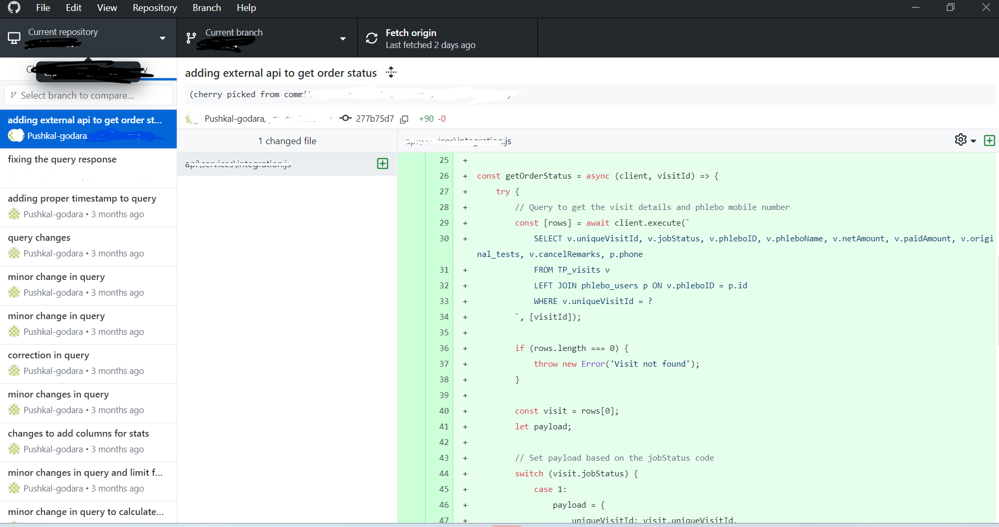

# Hi, I'm Pushkal Godara 👋
Backend Developer passionate about Database Optimization, API Design, Security Implementation(Very Critical), Performance Optimization, Real-time Processing, System Scalability 

## 🔧 Technologies & Tools
- Languages: JavaScript, TypeScript, Node.js
- Backend Frameworks: NestJS, SailsJS, Express
- Learning: ReactJS (Practice Projects)
- Databases: PostgreSQL with Sequelize ORM, MySQL
- Testing: Jest
- Documentation: Swagger
- Version Control: Git

## 💻 Featured Projects

### Enterprise Healthcare Management Platform (NestJS)
- Architected and developed a comprehensive healthcare platform handling multiple service verticals including pharmacy, laboratory, radiology, and doctor consultations
- Made 135 commits over 10 months, delivering key features across pharmacy ordering, lab testing, and doctor consultation modules
- Implemented end-to-end cart management system similar to e-commerce platforms, handling complex order flows and real-time inventory management
- Designed and developed 20+ database entities using PostgreSQL and Sequelize ORM, managing complex relationships across modules
- Built RESTful APIs enabling seamless integration between CRM dashboard and patient mobile application
- Structured modular codebase using NestJS and TypeScript, following domain-driven design principles
- Technologies: Node.js, NestJS, TypeScript, PostgreSQL, Sequelize ORM, REST APIs

#### 🚀 Development Journey

  
View Development Timeline

  
  
  
  
  

### Healthcare Management System - Phlebotomist Service Platform
- Developed and deployed a comprehensive backend system to beta/UAT environments using Node.js (Sails.js) and MySQL, managing phlebotomist services across hospital dashboard and mobile platforms
- Implemented REST APIs with 110 commits over 8 months of development, maintaining a consistent delivery pipeline to UAT
- Built core functionalities including job assignment system, real-time status tracking, roster management, and service area allocation
- Implemented secure role-based access control system differentiating between admin dashboard and phlebotomist mobile app permissions
- Architected database schema and business logic for 10+ core entities including job management, service tracking, and payment processing
- Technologies: Node.js, Sails.js, MySQL, REST APIs

#### 🚀 Development Journey

View Development Timeline

### Library Management System (Full-Stack Personal Project)
- Developed a full-stack library management application with role-based authentication (Admin, Librarian, Student)
- Implemented NestJS best practices using modular architecture with DTOs for validation, Controllers for routing, Services for business logic, and Providers for dependency injection
- Built RESTful APIs using NestJS and TypeScript, integrated with MySQL database using Sequelize ORM
- Created interactive dashboard using React.js featuring real-time book tracking, user management, and transaction monitoring
- Designed scalable module structure with 10+ core features (books, users, loans, reservations) following NestJS architectural patterns
- Implemented comprehensive API documentation using Swagger/OpenAPI for better developer experience
- Technologies: NestJS, React.js, TypeScript, MySQL, Sequelize ORM, Swagger

#### 🚀 Development Journey

View Repository Links

### Backend Repository

 
⚙️ [backend-repo](https://github.com/Pushkal-godara/lib-management-system)

📚 API Documentation: `http://localhost:1111/api#` (Available after running the server)

View API Documentation Preview

### API Documentation Preview
<table>
<tr>
<td width="33%">
<a href="./images/project_library/swagger-overview.png">

 
<em>API Overview (Click to enlarge)</em>
</a>
</td>
</tr>
<tr>
<td width="33%">
<a href="./images/project_library/book-endpoints.png">

 
<em>Book Management APIs (Click to enlarge)</em>
</a>
</td>
</tr>
</table>

### Frontend Repository

  
🎨 [frontend-repo](https://github.com/Pushkal-godara/library-management-ui)

## 📫 How to reach me
- Email: godarapushkal@gmail.com
- LinkedIn: [Your Profile]
